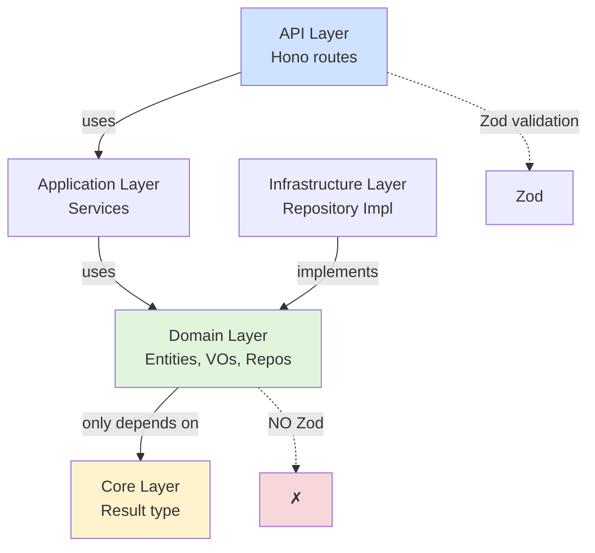

# ailab DDD Pattern Analysis & Comparison

## Executive Summary

mizchi/ailab の DDD サンプルを詳細分析し、現在の siftr バックエンド実装との比較を行いました。

**主要な発見:**
- ドメイン層は**純粋関数のみ**で実装（クラス不使用）
- アプリケーション層は**クラスベース**で依存性注入を使用
- Zod は API 層でのみ使用、ドメイン層では Result 型パターンを使用
- neverthrow ライブラリで Result 型を統一
- 完全な不変性（イミュータブル）パターン

## Layer Dependency Rules

### 依存関係の全体像



### 1. Core Layer (`core/result.ts`)

**依存: なし（neverthrow のみ）**

```typescript
// core/result.ts
import { Result as NeverThrowResult, ok, err } from 'neverthrow';

// Custom error classes
export class ValidationError extends Error {
  constructor(message: string) {
    super(message);
    this.name = 'ValidationError';
  }
}

export class NotFoundError extends Error {
  constructor(entityName: string, id: string) {
    super(`${entityName}が見つかりません: ${id}`);
    this.name = 'NotFoundError';
  }
}

// Re-export with custom types
export type Result<T, E = Error> = NeverThrowResult<T, E>;
export { ok, err };

// Utility functions
export function combine<T, E>(
  results: Result<T, E>[]
): Result<T[], E> {
  // Implementation
}
```

**重要ポイント:**
- すべてのレイヤーがこの Result 型を使用
- 例外をスローせず、エラーを値として扱う
- ValidationError, NotFoundError, SystemError の3つのエラークラス

### 2. Domain Layer

**依存: core/result.ts のみ**

#### 2.1 Value Objects (純粋関数)

```typescript
// domain/valueObjects/email.ts
import { err, ok, type Result, ValidationError } from '../../core/result.ts';

export type Email = string & { readonly brand: unique symbol };

const EMAIL_REGEX = /^[^\s@]+@[^\s@]+\.[^\s@]+$/;

// Factory function (NO class!)
export function createEmail(value: string): Result<Email, ValidationError> {
  const trimmed = value.trim();

  if (!trimmed) {
    return err(new ValidationError('メールアドレスは必須です'));
  }

  if (!EMAIL_REGEX.test(trimmed)) {
    return err(new ValidationError('無効なメールアドレス形式です'));
  }

  return ok(trimmed.toLowerCase() as Email);
}

// Helper functions
export function getDomain(email: Email): string {
  return email.split('@')[1];
}

export function emailEquals(email1: Email, email2: Email): boolean {
  return email1.toLowerCase() === email2.toLowerCase();
}
```

**パターン:**
- ✅ 純粋関数のみ
- ✅ Branded Type でタイプセーフティ
- ✅ Result 型で検証エラーを返す
- ❌ クラス不使用
- ❌ Zod 不使用（カスタム検証ロジック）

#### 2.2 Entities (純粋関数 + Factory パターン)

```typescript
// domain/entities/order.ts
import type { CustomerId, Money, OrderId, OrderStatus, ProductId, Quantity } from '../types.ts';
import { err, ok, type Result, ValidationError } from '../../core/result.ts';

// Entity interface (NOT class!)
export interface Order {
  readonly id: OrderId;
  readonly customerId: CustomerId;
  readonly orderLines: OrderLine[];
  readonly status: OrderStatus;
  readonly totalAmount: Money;
  readonly createdAt: Date;
  readonly updatedAt: Date;
}

export interface OrderLine {
  readonly productId: ProductId;
  readonly quantity: Quantity;
  readonly unitPrice: Money;
}

// Factory function for new order
export function createOrder(
  id: OrderId,
  customerId: CustomerId,
  orderLines: OrderLine[]
): Result<Order, ValidationError> {
  // Validation
  if (orderLines.length === 0) {
    return err(new ValidationError('注文明細が空です'));
  }

  const totalAmount = calculateTotalAmount(orderLines);
  if (totalAmount <= 0) {
    return err(new ValidationError('合計金額が不正です'));
  }

  const now = new Date();

  // Return immutable object
  return ok({
    id,
    customerId,
    orderLines,
    status: { kind: 'pending' },
    totalAmount,
    createdAt: now,
    updatedAt: now,
  });
}

// State transition functions (pure, immutable)
export function payOrder(
  order: Order,
  paidAt: Date
): Result<Order, ValidationError> {
  // Business rule validation
  if (order.status.kind !== 'pending') {
    return err(new ValidationError(`${order.status.kind}状態の注文は支払いできません`));
  }

  // Immutable update with spread operator
  return ok({
    ...order,
    status: { kind: 'paid', paidAt },
    updatedAt: new Date(),
  });
}

export function shipOrder(
  order: Order,
  shippedAt: Date
): Result<Order, ValidationError> {
  if (order.status.kind !== 'paid') {
    return err(new ValidationError('未払いの注文は出荷できません'));
  }

  return ok({
    ...order,
    status: { kind: 'shipped', shippedAt },
    updatedAt: new Date(),
  });
}

export function cancelOrder(
  order: Order,
  reason: string
): Result<Order, ValidationError> {
  if (order.status.kind === 'delivered') {
    return err(new ValidationError('配送済みの注文はキャンセルできません'));
  }

  return ok({
    ...order,
    status: { kind: 'cancelled', reason, cancelledAt: new Date() },
    updatedAt: new Date(),
  });
}

// Helper functions
function calculateTotalAmount(orderLines: OrderLine[]): number {
  return orderLines.reduce((sum, line) => sum + line.quantity * line.unitPrice, 0);
}
```

**重要パターン:**
- ✅ **Interface + Pure Functions** (NOT class with methods)
- ✅ **Factory 関数**: `createOrder()`, `reconstructOrder()`
- ✅ **State transition 関数**: `payOrder()`, `shipOrder()`, `cancelOrder()`
- ✅ **完全な不変性**: スプレッド演算子で新しいオブジェクト生成
- ✅ **ビジネスルール検証**: 各関数内で状態遷移のルールチェック
- ❌ **クラスメソッド不使用**: `order.pay()` ではなく `payOrder(order)`

#### 2.3 Repository Interface

```typescript
// domain/repositories/orderRepository.ts
import type { Order } from '../entities/order.ts';
import type { CustomerId, OrderId, OrderStatus, ProductId } from '../types.ts';
import type { Result, ValidationError, NotFoundError } from '../../core/result.ts';

// Interface only in domain layer
export interface OrderRepository {
  findById(id: OrderId): Promise<Result<Order | null, ValidationError | NotFoundError>>;
  findByCustomerId(customerId: CustomerId): Promise<Result<Order[], ValidationError | NotFoundError>>;
  findByProductId(productId: ProductId): Promise<Result<Order[], ValidationError | NotFoundError>>;
  findByStatus(status: OrderStatus['kind']): Promise<Result<Order[], ValidationError | NotFoundError>>;
  findAll(): Promise<Result<Order[], ValidationError | NotFoundError>>;

  save(order: Order): Promise<Result<void, ValidationError>>;
  delete(id: OrderId): Promise<Result<void, ValidationError | NotFoundError>>;

  exists(id: OrderId): Promise<Result<boolean, ValidationError>>;
}
```

**重要ポイント:**
- ✅ インターフェースのみ（実装はない）
- ✅ すべてのメソッドが Result 型を返す
- ✅ エラー型を明示（ValidationError | NotFoundError）

### 3. Application Layer (クラスベース)

**依存: domain/* (interfaces のみ)**

```typescript
// application/orderService.ts
import type { Order } from '../domain/entities/order.ts';
import { createOrder, payOrder, shipOrder, deliverOrder, cancelOrder } from '../domain/entities/order.ts';
import type { OrderRepository } from '../domain/repositories/orderRepository.ts';
import type { CustomerRepository } from '../domain/repositories/customerRepository.ts';
import type { ProductRepository } from '../domain/repositories/productRepository.ts';
import { err, ok, type Result, ValidationError, NotFoundError } from '../core/result.ts';
import type { CustomerId, OrderId, ProductId, Quantity } from '../domain/types.ts';

// DTO for API layer
export interface CreateOrderDto {
  customerId: string;
  orderLines: Array<{
    productId: string;
    quantity: number;
  }>;
}

export interface OrderInfoDto {
  id: string;
  customerId: string;
  totalAmount: number;
  status: string;
  createdAt: string;
}

// Application Service (class-based with DI)
export class OrderApplicationService {
  constructor(
    private orderRepository: OrderRepository,
    private customerRepository: CustomerRepository,
    private productRepository: ProductRepository
  ) {}

  /**
   * 注文を作成する
   */
  async createOrder(dto: CreateOrderDto): Promise<Result<OrderInfoDto, ValidationError | NotFoundError>> {
    // 1. Validate customer exists
    const customerResult = await this.customerRepository.findById(dto.customerId as CustomerId);
    if (!customerResult.ok) return customerResult;
    if (!customerResult.value) {
      return err(new NotFoundError('顧客', dto.customerId));
    }

    // 2. Validate products exist
    const orderLines = [];
    for (const line of dto.orderLines) {
      const productResult = await this.productRepository.findById(line.productId as ProductId);
      if (!productResult.ok) return productResult;
      if (!productResult.value) {
        return err(new NotFoundError('商品', line.productId));
      }

      orderLines.push({
        productId: line.productId as ProductId,
        quantity: line.quantity as Quantity,
        unitPrice: productResult.value.price,
      });
    }

    // 3. Generate order ID
    const orderId = crypto.randomUUID() as OrderId;

    // 4. Create order entity (domain logic)
    const orderResult = createOrder(orderId, dto.customerId as CustomerId, orderLines);
    if (!orderResult.ok) return orderResult;

    // 5. Save to repository
    const saveResult = await this.orderRepository.save(orderResult.value);
    if (!saveResult.ok) return saveResult;

    // 6. Convert to DTO
    return ok(this.toOrderInfoDto(orderResult.value));
  }

  /**
   * 注文を支払い済みにする
   */
  async payOrder(orderId: string): Promise<Result<OrderInfoDto, ValidationError | NotFoundError>> {
    // 1. Find order
    const orderResult = await this.orderRepository.findById(orderId as OrderId);
    if (!orderResult.ok) return orderResult;
    if (!orderResult.value) {
      return err(new NotFoundError('注文', orderId));
    }

    // 2. Apply domain logic
    const paidOrderResult = payOrder(orderResult.value, new Date());
    if (!paidOrderResult.ok) return paidOrderResult;

    // 3. Save updated order
    const saveResult = await this.orderRepository.save(paidOrderResult.value);
    if (!saveResult.ok) return saveResult;

    // 4. Return DTO
    return ok(this.toOrderInfoDto(paidOrderResult.value));
  }

  // Helper to convert entity to DTO
  private toOrderInfoDto(order: Order): OrderInfoDto {
    return {
      id: order.id,
      customerId: order.customerId,
      totalAmount: order.totalAmount,
      status: order.status.kind,
      createdAt: order.createdAt.toISOString(),
    };
  }

  // ... other methods: shipOrder, deliverOrder, cancelOrder
}
```

**重要パターン:**
- ✅ **クラスベース** (domain は関数、application はクラス)
- ✅ **Constructor Injection**: リポジトリを注入
- ✅ **DTO 変換**: Entity ↔ DTO の変換をここで実施
- ✅ **オーケストレーション**: 複数のリポジトリ + ドメインロジックを組み合わせる
- ✅ **Result チェーン**: すべての Result をチェックして早期リターン

### 4. Infrastructure Layer

**依存: domain/* を実装**

```typescript
// infrastructure/repositories/inMemoryOrderRepository.ts
import type { Order } from '../../domain/entities/order.ts';
import type { OrderRepository } from '../../domain/repositories/orderRepository.ts';
import type { CustomerId, OrderId, OrderStatus, ProductId } from '../../domain/types.ts';
import { err, NotFoundError, ok, type Result, type ValidationError } from '../../core/result.ts';

export class InMemoryOrderRepository implements OrderRepository {
  private orders: Map<string, Order> = new Map();

  async findById(id: OrderId): Promise<Result<Order | null, ValidationError | NotFoundError>> {
    const order = this.orders.get(id);
    return ok(order || null);
  }

  async findByCustomerId(customerId: CustomerId): Promise<Result<Order[], ValidationError | NotFoundError>> {
    const customerOrders = Array.from(this.orders.values()).filter(
      (order) => order.customerId === customerId
    );
    return ok(customerOrders);
  }

  async save(order: Order): Promise<Result<void, ValidationError>> {
    // Deep copy to prevent reference issues
    this.orders.set(order.id, JSON.parse(JSON.stringify(order)));
    return ok(undefined);
  }

  async delete(id: OrderId): Promise<Result<void, ValidationError | NotFoundError>> {
    if (!this.orders.has(id)) {
      return err(new NotFoundError('注文', id));
    }
    this.orders.delete(id);
    return ok(undefined);
  }

  // Test helper methods
  clear(): void {
    this.orders.clear();
  }

  async initializeWithSampleData(): Promise<void> {
    // Sample data initialization
  }
}
```

**重要ポイント:**
- ✅ Domain の Repository インターフェースを実装
- ✅ 実装の詳細はドメイン層から隠蔽
- ✅ テストヘルパーメソッド（clear, initializeWithSampleData）を追加可能

### 5. API Layer

**依存: application/* を使用、Zod で検証**

```typescript
// api/routes/orders.ts (概念的な例)
import { Hono } from 'hono';
import { z } from 'zod';
import type { OrderApplicationService } from '../../application/orderService.ts';

const ordersRouter = new Hono();

// Zod schema for API validation
const CreateOrderRequestSchema = z.object({
  customerId: z.string().uuid(),
  orderLines: z.array(z.object({
    productId: z.string().uuid(),
    quantity: z.number().int().positive(),
  })).min(1),
});

ordersRouter.post('/', async (c) => {
  // 1. Validate request with Zod
  const bodyResult = CreateOrderRequestSchema.safeParse(await c.req.json());
  if (!bodyResult.success) {
    return c.json({ error: 'Invalid request', details: bodyResult.error }, 400);
  }

  // 2. Call application service
  const orderService: OrderApplicationService = c.get('orderService');
  const result = await orderService.createOrder(bodyResult.data);

  // 3. Handle Result type
  if (!result.ok) {
    if (result.error.name === 'NotFoundError') {
      return c.json({ error: result.error.message }, 404);
    }
    return c.json({ error: result.error.message }, 400);
  }

  // 4. Return DTO
  return c.json(result.value, 201);
});
```

**重要ポイント:**
- ✅ **Zod は API 層でのみ使用** (HTTP リクエスト検証)
- ✅ Application Service を DI で取得
- ✅ Result 型を HTTP レスポンスに変換

## Zod Usage Guidelines

### ✅ Zod を使用して良い場所

1. **API Layer (HTTP Request Validation)**
   ```typescript
   // api/routes/articles.ts
   const GetArticlesQuerySchema = z.object({
     category: z.enum(['technology', 'hr', 'business']).optional(),
     limit: z.string().transform(Number).pipe(z.number().int().positive().max(100)),
   });
   ```

2. **Types Definition (Minimal)**
   ```typescript
   // domain/types.ts
   import { z } from 'zod';

   // Only for type definition, not for validation
   export const CategorySchema = z.enum(['technology', 'hr', 'business']);
   export type Category = z.infer<typeof CategorySchema>;
   ```

3. **Configuration Parsing**
   ```typescript
   // config/env.ts
   const EnvSchema = z.object({
     DATABASE_URL: z.string().url(),
     AWS_REGION: z.string(),
   });

   export const env = EnvSchema.parse(process.env);
   ```

### ❌ Zod を使用してはいけない場所

1. **Domain Logic (Use Result type instead)**
   ```typescript
   // ❌ BAD: Domain using Zod
   export function createEmail(value: string): Email {
     return EmailSchema.parse(value); // Throws exception!
   }

   // ✅ GOOD: Domain using Result type
   export function createEmail(value: string): Result<Email, ValidationError> {
     if (!EMAIL_REGEX.test(value)) {
       return err(new ValidationError('Invalid email'));
     }
     return ok(value as Email);
   }
   ```

2. **Value Objects (Use custom validation)**
   ```typescript
   // ❌ BAD
   export const PriorityScoreSchema = z.number().min(0).max(100);
   export type PriorityScore = z.infer<typeof PriorityScoreSchema>;

   // ✅ GOOD
   export type PriorityScore = number & { readonly brand: unique symbol };

   export function createPriorityScore(value: number): Result<PriorityScore, ValidationError> {
     if (value < 0 || value > 100) {
       return err(new ValidationError('Priority score must be 0-100'));
     }
     return ok(value as PriorityScore);
   }
   ```

## Function-Based vs Class-Based

### Domain Layer: 純粋関数のみ

```typescript
// ✅ GOOD: Pure functions
export function createOrder(...): Result<Order> { }
export function payOrder(order: Order): Result<Order> { }
export function calculateTotal(lines: OrderLine[]): number { }

// ❌ BAD: Classes in domain
export class Order {
  pay(): void { } // Side effects! State mutation!
}
```

**理由:**
- **テスタビリティ**: 純粋関数は入力→出力が明確
- **不変性**: クラスは状態を持ちやすく、ミューテーションのリスク
- **関数合成**: 小さな関数を組み合わせやすい

### Application Layer: クラスベース

```typescript
// ✅ GOOD: Class with constructor injection
export class OrderApplicationService {
  constructor(
    private orderRepo: OrderRepository,
    private customerRepo: CustomerRepository
  ) {}

  async createOrder(dto: CreateOrderDto): Promise<Result<OrderInfoDto>> {
    // Orchestration logic
  }
}

// ❌ BAD: Global state or direct imports
import { orderRepository } from '../adapters/db'; // Tight coupling!
```

**理由:**
- **依存性注入**: テスト時にモックリポジトリを注入可能
- **ライフサイクル管理**: リポジトリ接続などの初期化を管理
- **オーケストレーション**: 複数のドメイン操作をまとめる

## Directory Structure Comparison

### ailab Structure

```
apps/ddd-sample/
├── core/
│   └── result.ts              # Result type, error classes
├── domain/
│   ├── entities/
│   │   ├── order.ts           # Pure functions (createOrder, payOrder, etc.)
│   │   └── customer.ts
│   ├── valueObjects/
│   │   ├── email.ts           # Pure functions (createEmail, validateEmail)
│   │   └── money.ts
│   ├── repositories/
│   │   ├── orderRepository.ts # Interface only
│   │   └── customerRepository.ts
│   └── types.ts               # Shared types (OrderId, CustomerId, etc.)
├── application/
│   └── orderService.ts        # Class-based service with DI
├── infrastructure/
│   └── repositories/
│       └── inMemoryOrderRepository.ts  # Implementation
└── api/
    └── routes/
        └── orders.ts          # Hono routes with Zod validation
```

### Current siftr Structure

```
backend/src/
├── core/
│   └── result.ts              # ✅ Same pattern
├── domain/
│   ├── models/
│   │   ├── article.ts         # ❌ Using Zod schemas
│   │   └── article.test.ts    # ✅ Tests exist
│   └── repositories/
│       └── article-repository.ts  # ✅ Interface only
├── application/
│   └── (not yet implemented)  # ❌ Missing
├── adapters/
│   └── db/
│       └── dynamodb-article-repository.ts  # ✅ Implementation
└── api/
    ├── index.ts               # ✅ Hono app
    ├── middleware/
    │   └── auth.ts            # ✅ Cognito auth
    └── routes/
        ├── articles.ts        # ✅ Zod validation
        └── user.ts
```

## Refactoring Recommendations

### 1. Replace Zod with Result Type in Domain Layer

**Before (Current):**
```typescript
// domain/models/article.ts
export const ArticleSchema = z.object({
  articleId: ArticleIdSchema,
  title: z.string().min(1),
  // ...
});

export type Article = z.infer<typeof ArticleSchema>;

export function createUninitializedArticle(params: CreateArticleParams): Article {
  return ArticleSchema.parse({  // ❌ Throws exception
    articleId: params.articleId,
    // ...
  });
}
```

**After (Recommended):**
```typescript
// domain/models/article.ts
import { err, ok, type Result, ValidationError } from '../core/result.ts';

// Simple type definition (no Zod)
export interface Article {
  readonly articleId: ArticleId;
  readonly title: string;
  readonly url: string;
  readonly category: Category;
  readonly priorityScore: PriorityScore;
  readonly createdAt: Date;
  readonly updatedAt: Date;
}

// Factory function with Result type
export function createUninitializedArticle(
  params: CreateArticleParams
): Result<Article, ValidationError> {
  // Validation
  if (!params.title.trim()) {
    return err(new ValidationError('タイトルは必須です'));
  }

  if (!isValidUrl(params.url)) {
    return err(new ValidationError('無効なURL形式です'));
  }

  const now = new Date();

  return ok({
    articleId: params.articleId,
    title: params.title.trim(),
    url: params.url,
    category: params.category,
    priorityScore: 50 as PriorityScore, // Default
    status: 'uninitialized',
    createdAt: now,
    updatedAt: now,
  });
}

// Pure function for domain logic
export function calculatePriorityScore(
  article: Article,
  userProfile: UserProfile
): Article {
  let score = 50;

  // Skill gap analysis
  const userSkills = new Set(userProfile.skills.map(s => s.keyword));
  const articleSkills = article.aiAnalysis?.requiredSkills || [];
  const matchingSkills = articleSkills.filter(skill => userSkills.has(skill));

  score += matchingSkills.length * 10;

  // Category boost
  if (userProfile.interests.includes(article.category)) {
    score += 20;
  }

  // Clamp to 0-100
  const clampedScore = Math.max(0, Math.min(100, score));

  // Immutable update
  return {
    ...article,
    priorityScore: clampedScore as PriorityScore,
    updatedAt: new Date(),
  };
}
```

### 2. Create Application Service Layer

**New File: `application/articleService.ts`**

```typescript
import type { Article } from '../domain/models/article.ts';
import { createUninitializedArticle, calculatePriorityScore } from '../domain/models/article.ts';
import type { ArticleRepository } from '../domain/repositories/article-repository.ts';
import type { UserRepository } from '../domain/repositories/user-repository.ts';
import { err, ok, type Result, ValidationError, NotFoundError } from '../core/result.ts';
import type { ArticleId, UserId } from '../domain/types.ts';

// DTOs
export interface CreateArticleDto {
  url: string;
  userId: string;
}

export interface ArticleInfoDto {
  articleId: string;
  title: string;
  url: string;
  category: string;
  priorityScore: number;
  status: string;
  createdAt: string;
}

// Application Service (class-based with DI)
export class ArticleApplicationService {
  constructor(
    private articleRepo: ArticleRepository,
    private userRepo: UserRepository
  ) {}

  async createArticle(dto: CreateArticleDto): Promise<Result<ArticleInfoDto, ValidationError | NotFoundError>> {
    // 1. Validate user exists
    const userResult = await this.userRepo.findById(dto.userId as UserId);
    if (!userResult.ok) return userResult;
    if (!userResult.value) {
      return err(new NotFoundError('ユーザー', dto.userId));
    }

    // 2. Generate article ID
    const articleId = crypto.randomUUID() as ArticleId;

    // 3. Create article entity (domain logic)
    const articleResult = createUninitializedArticle({
      articleId,
      userId: dto.userId as UserId,
      url: dto.url,
      title: '', // Will be scraped later
      category: 'technology', // Default
    });
    if (!articleResult.ok) return articleResult;

    // 4. Save to repository
    const saveResult = await this.articleRepo.save(articleResult.value);
    if (!saveResult.ok) return saveResult;

    // 5. Return DTO
    return ok(this.toArticleInfoDto(articleResult.value));
  }

  async calculatePriority(articleId: string, userId: string): Promise<Result<ArticleInfoDto, ValidationError | NotFoundError>> {
    // 1. Find article
    const articleResult = await this.articleRepo.findById(articleId as ArticleId);
    if (!articleResult.ok) return articleResult;
    if (!articleResult.value) {
      return err(new NotFoundError('記事', articleId));
    }

    // 2. Find user profile
    const userResult = await this.userRepo.findById(userId as UserId);
    if (!userResult.ok) return userResult;
    if (!userResult.value) {
      return err(new NotFoundError('ユーザー', userId));
    }

    // 3. Apply domain logic
    const scoredArticle = calculatePriorityScore(
      articleResult.value,
      userResult.value.profile
    );

    // 4. Save updated article
    const saveResult = await this.articleRepo.save(scoredArticle);
    if (!saveResult.ok) return saveResult;

    // 5. Return DTO
    return ok(this.toArticleInfoDto(scoredArticle));
  }

  private toArticleInfoDto(article: Article): ArticleInfoDto {
    return {
      articleId: article.articleId,
      title: article.title,
      url: article.url,
      category: article.category,
      priorityScore: article.priorityScore,
      status: article.status,
      createdAt: article.createdAt.toISOString(),
    };
  }
}
```

### 3. Update API Layer to Use Application Service

**Before:**
```typescript
// api/routes/articles.ts (direct repository access)
articlesRouter.post('/', async (c) => {
  const body = CreateArticleRequestSchema.parse(await c.req.json());

  const article = createUninitializedArticle(body); // Domain function
  await articleRepository.save(article);            // Direct DB access

  return c.json(article);
});
```

**After:**
```typescript
// api/routes/articles.ts (via application service)
import { z } from 'zod';
import type { ArticleApplicationService } from '../../application/articleService.ts';

const CreateArticleRequestSchema = z.object({
  url: z.string().url(),
});

articlesRouter.post('/', async (c) => {
  // 1. Zod validation for HTTP request
  const bodyResult = CreateArticleRequestSchema.safeParse(await c.req.json());
  if (!bodyResult.success) {
    return c.json({ error: 'Invalid request', details: bodyResult.error }, 400);
  }

  // 2. Get user from auth middleware
  const user = c.get('user');

  // 3. Call application service
  const articleService: ArticleApplicationService = c.get('articleService');
  const result = await articleService.createArticle({
    url: bodyResult.data.url,
    userId: user.sub,
  });

  // 4. Handle Result type
  if (!result.ok) {
    if (result.error.name === 'NotFoundError') {
      return c.json({ error: result.error.message }, 404);
    }
    return c.json({ error: result.error.message }, 400);
  }

  // 5. Return DTO
  return c.json(result.value, 201);
});
```

### 4. Update Repository to Match Pattern

**Before:**
```typescript
// domain/repositories/article-repository.ts
export type Result<T, E = Error> = { ok: true; value: T } | { ok: false; error: E };

export interface ArticleRepository {
  save(article: Article): Promise<Result<Article>>;
  // ...
}
```

**After:**
```typescript
// domain/repositories/article-repository.ts
import type { Result, ValidationError, NotFoundError } from '../../core/result.ts';
import type { Article } from '../models/article.ts';
import type { ArticleId, UserId, Category } from '../types.ts';

export interface ArticleRepository {
  findById(articleId: ArticleId): Promise<Result<Article | null, ValidationError | NotFoundError>>;
  findByUserId(userId: UserId): Promise<Result<Article[], ValidationError>>;
  findByCategory(userId: UserId, category: Category): Promise<Result<Article[], ValidationError>>;

  save(article: Article): Promise<Result<void, ValidationError>>;
  delete(articleId: ArticleId): Promise<Result<void, ValidationError | NotFoundError>>;

  exists(articleId: ArticleId): Promise<Result<boolean, ValidationError>>;
}
```

## Testing Strategy

### Domain Layer Tests (Pure Functions)

```typescript
// domain/models/article.test.ts
import { describe, it, expect } from 'vitest';
import { createUninitializedArticle, calculatePriorityScore } from './article.ts';
import type { UserProfile } from './user.ts';

describe('createUninitializedArticle', () => {
  it('should create article with valid parameters', () => {
    const result = createUninitializedArticle({
      articleId: 'test-id' as ArticleId,
      userId: 'user-id' as UserId,
      url: 'https://example.com',
      title: 'Test Article',
      category: 'technology',
    });

    expect(result.ok).toBe(true);
    if (result.ok) {
      expect(result.value.title).toBe('Test Article');
      expect(result.value.priorityScore).toBe(50); // Default
    }
  });

  it('should return error for empty title', () => {
    const result = createUninitializedArticle({
      articleId: 'test-id' as ArticleId,
      userId: 'user-id' as UserId,
      url: 'https://example.com',
      title: '   ', // Empty after trim
      category: 'technology',
    });

    expect(result.ok).toBe(false);
    if (!result.ok) {
      expect(result.error.name).toBe('ValidationError');
      expect(result.error.message).toContain('タイトルは必須です');
    }
  });
});

describe('calculatePriorityScore', () => {
  it('should increase score for matching skills', () => {
    const article: Article = {
      articleId: 'test-id' as ArticleId,
      userId: 'user-id' as UserId,
      title: 'TypeScript Best Practices',
      url: 'https://example.com',
      category: 'technology',
      priorityScore: 50 as PriorityScore,
      status: 'analyzed',
      aiAnalysis: {
        requiredSkills: ['TypeScript', 'Node.js'],
        difficulty: 'intermediate',
      },
      createdAt: new Date(),
      updatedAt: new Date(),
    };

    const userProfile: UserProfile = {
      interests: ['technology'],
      skills: [
        { keyword: 'TypeScript', level: 'advanced' },
        { keyword: 'React', level: 'intermediate' },
      ],
    };

    const scored = calculatePriorityScore(article, userProfile);

    expect(scored.priorityScore).toBeGreaterThan(50);
    // 50 + 10 (TypeScript match) + 20 (technology interest) = 80
    expect(scored.priorityScore).toBe(80);
  });

  it('should be immutable (not mutate original)', () => {
    const original: Article = { /* ... */ };
    const updated = calculatePriorityScore(original, userProfile);

    expect(updated).not.toBe(original); // Different object
    expect(original.priorityScore).toBe(50); // Original unchanged
    expect(updated.priorityScore).not.toBe(50); // Updated changed
  });
});
```

### Application Layer Tests (with Mocks)

```typescript
// application/articleService.test.ts
import { describe, it, expect, beforeEach } from 'vitest';
import { ArticleApplicationService } from './articleService.ts';
import type { ArticleRepository } from '../domain/repositories/article-repository.ts';
import type { UserRepository } from '../domain/repositories/user-repository.ts';
import { ok, err, NotFoundError } from '../core/result.ts';

describe('ArticleApplicationService', () => {
  let service: ArticleApplicationService;
  let mockArticleRepo: ArticleRepository;
  let mockUserRepo: UserRepository;

  beforeEach(() => {
    // Create mock repositories
    mockArticleRepo = {
      save: async (article) => ok(undefined),
      findById: async (id) => ok(null),
      // ... other methods
    };

    mockUserRepo = {
      findById: async (id) => ok({
        userId: id,
        email: 'test@example.com',
        profile: { interests: ['technology'], skills: [] },
      }),
      // ... other methods
    };

    service = new ArticleApplicationService(mockArticleRepo, mockUserRepo);
  });

  it('should create article successfully', async () => {
    const result = await service.createArticle({
      url: 'https://example.com',
      userId: 'user-123',
    });

    expect(result.ok).toBe(true);
    if (result.ok) {
      expect(result.value.url).toBe('https://example.com');
    }
  });

  it('should return error when user not found', async () => {
    // Mock user not found
    mockUserRepo.findById = async (id) => ok(null);

    const result = await service.createArticle({
      url: 'https://example.com',
      userId: 'nonexistent',
    });

    expect(result.ok).toBe(false);
    if (!result.ok) {
      expect(result.error.name).toBe('NotFoundError');
    }
  });
});
```

## Summary: Key Takeaways

### 1. Layer Dependencies
```
API → Application → Domain → Core
         ↓            ↓
    Infrastructure ←──┘
```

- **Domain**: NO dependencies (except core/result)
- **Application**: Uses domain interfaces only
- **Infrastructure**: Implements domain interfaces
- **API**: Uses application services + Zod validation

### 2. Function vs Class

| Layer | Pattern | Reason |
|-------|---------|--------|
| Domain | **Pure Functions** | Testability, immutability, composition |
| Application | **Classes (DI)** | Orchestration, lifecycle management |
| Infrastructure | **Classes** | Connection pooling, resource management |
| API | **Functions (Hono)** | Stateless HTTP handlers |

### 3. Zod Usage

| Layer | Zod Usage | Alternative |
|-------|-----------|-------------|
| API | ✅ Request/Response validation | - |
| Application | ❌ Use DTO types | TypeScript interfaces |
| Domain | ❌ Use Result type | Custom validation with Result |
| Infrastructure | ❌ Use domain types | Domain interfaces |

### 4. Error Handling

**Never throw exceptions in domain/application:**

```typescript
// ❌ BAD
export function createOrder(params): Order {
  if (params.total <= 0) {
    throw new Error('Invalid total'); // Exception!
  }
  return order;
}

// ✅ GOOD
export function createOrder(params): Result<Order, ValidationError> {
  if (params.total <= 0) {
    return err(new ValidationError('Invalid total'));
  }
  return ok(order);
}
```

### 5. Immutability

**Always return new objects, never mutate:**

```typescript
// ❌ BAD
export function payOrder(order: Order): Order {
  order.status = 'paid'; // Mutation!
  order.updatedAt = new Date();
  return order;
}

// ✅ GOOD
export function payOrder(order: Order): Result<Order, ValidationError> {
  return ok({
    ...order,
    status: 'paid',
    updatedAt: new Date(),
  });
}
```

## Next Steps for Refactoring

1. **Create `core/result.ts`** with neverthrow wrapper ✅ (already exists)
2. **Refactor domain/models/article.ts** to use Result type instead of Zod
3. **Create `application/articleService.ts`** with class-based service
4. **Update `api/routes/articles.ts`** to use application service
5. **Update tests** to follow new patterns
6. **Add value objects** (ArticleId, PriorityScore, etc.) with branded types
7. **Create `domain/types.ts`** for shared type definitions
8. **Update repository interface** to match ailab pattern (explicit error types)

## References

- [mizchi/ailab - ddd-sample](https://github.com/mizchi/ailab/tree/main/apps/ddd-sample)
- [mizchi/ailab - ddd-sample-light](https://github.com/mizchi/ailab/tree/main/apps/ddd-sample-light)
- [neverthrow](https://github.com/supermacro/neverthrow) - Result type library
- [Domain-Driven Design](https://www.domainlanguage.com/ddd/) - Eric Evans
