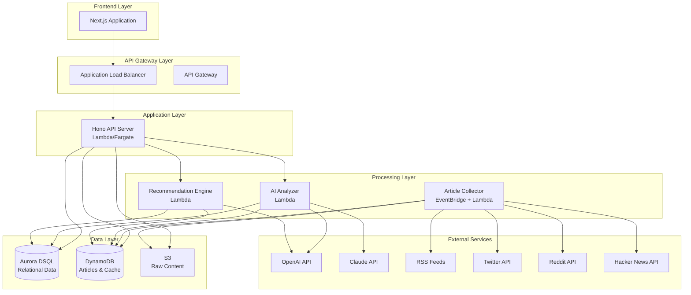
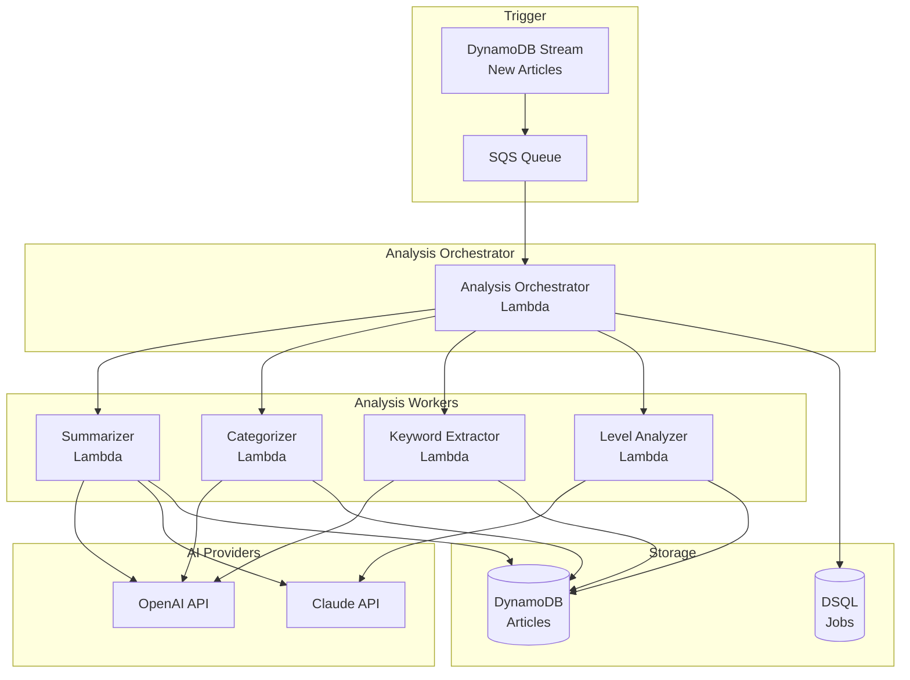

# siftr バックエンド設計書

## 1. システムアーキテクチャ概要

### 1.1 全体構成



### 1.2 アーキテクチャの設計原則

1. **サーバーレスファースト**: コスト効率と運用負荷の最小化
2. **非同期処理の活用**: 重い処理はバックグラウンドで実行
3. **データストア適材適所**: リレーショナルデータとドキュメントデータの使い分け
4. **AI APIのフェイルオーバー**: OpenAI/Claude の切り替え対応
5. **スケーラビリティ**: 将来的なマルチユーザー対応を考慮

## 2. データベース設計

### 2.1 データストア選定理由

#### Aurora DSQL
- **用途**: ユーザー設定、情報源管理、推薦履歴など構造化データ
- **理由**:
  - ACID特性が必要なトランザクション処理
  - 複雑なクエリ（JOIN、集計）が必要
  - データ整合性が重要

#### DynamoDB
- **用途**: 記事データ、要約、閲覧履歴など大量のドキュメント
- **理由**:
  - 高速な読み書き性能
  - スケーラビリティ
  - 記事コンテンツのような可変長データに適している
  - TTL機能で古いデータの自動削除

#### S3
- **用途**: 生の記事HTML、画像、大容量コンテンツ
- **理由**:
  - コスト効率
  - 無制限のストレージ
  - CloudFront連携

### 2.2 Aurora DSQL スキーマ

```sql
-- ユーザーテーブル
CREATE TABLE users (
    user_id UUID PRIMARY KEY DEFAULT gen_random_uuid(),
    email VARCHAR(255) UNIQUE NOT NULL,
    display_name VARCHAR(100),
    created_at TIMESTAMP DEFAULT CURRENT_TIMESTAMP,
    updated_at TIMESTAMP DEFAULT CURRENT_TIMESTAMP,
    settings JSONB DEFAULT '{}',
    CONSTRAINT email_format CHECK (email ~* '^[A-Za-z0-9._%+-]+@[A-Za-z0-9.-]+\.[A-Za-z]{2,}$')
);

-- ユーザースキルプロファイル
CREATE TABLE user_skill_profiles (
    profile_id UUID PRIMARY KEY DEFAULT gen_random_uuid(),
    user_id UUID NOT NULL REFERENCES users(user_id) ON DELETE CASCADE,
    category VARCHAR(50) NOT NULL, -- 'technology', 'hr', 'business'
    skill_level VARCHAR(20) NOT NULL, -- 'beginner', 'intermediate', 'advanced'
    interests JSONB DEFAULT '[]', -- 配列形式の興味キーワード
    created_at TIMESTAMP DEFAULT CURRENT_TIMESTAMP,
    updated_at TIMESTAMP DEFAULT CURRENT_TIMESTAMP,
    UNIQUE(user_id, category)
);

CREATE INDEX idx_user_skill_profiles_user_id ON user_skill_profiles(user_id);

-- 情報源管理
CREATE TABLE sources (
    source_id UUID PRIMARY KEY DEFAULT gen_random_uuid(),
    user_id UUID NOT NULL REFERENCES users(user_id) ON DELETE CASCADE,
    source_type VARCHAR(20) NOT NULL, -- 'rss', 'twitter', 'reddit', 'hackernews', 'manual'
    name VARCHAR(255) NOT NULL,
    url TEXT NOT NULL,
    category VARCHAR(50), -- 'technology', 'hr', 'business', 'general'
    is_active BOOLEAN DEFAULT true,
    collection_frequency_minutes INT DEFAULT 60, -- 収集頻度（分）
    last_collected_at TIMESTAMP,
    metadata JSONB DEFAULT '{}', -- API keys, filter settings等
    created_at TIMESTAMP DEFAULT CURRENT_TIMESTAMP,
    updated_at TIMESTAMP DEFAULT CURRENT_TIMESTAMP
);

CREATE INDEX idx_sources_user_id ON sources(user_id);
CREATE INDEX idx_sources_active ON sources(is_active) WHERE is_active = true;

-- 推薦履歴（集計用）
CREATE TABLE recommendation_history (
    recommendation_id UUID PRIMARY KEY DEFAULT gen_random_uuid(),
    user_id UUID NOT NULL REFERENCES users(user_id) ON DELETE CASCADE,
    article_id VARCHAR(255) NOT NULL, -- DynamoDBのarticle_id
    recommended_at TIMESTAMP DEFAULT CURRENT_TIMESTAMP,
    recommendation_type VARCHAR(50) NOT NULL, -- 'trending', 'personalized', 'skill_gap', 'related'
    score DECIMAL(5,2), -- 推薦スコア 0-100
    reason TEXT, -- 推薦理由
    user_action VARCHAR(20), -- 'viewed', 'dismissed', 'saved', 'rated'
    user_rating INT, -- 1-5段階評価
    feedback_at TIMESTAMP
);

CREATE INDEX idx_recommendation_history_user_id ON recommendation_history(user_id);
CREATE INDEX idx_recommendation_history_article_id ON recommendation_history(article_id);
CREATE INDEX idx_recommendation_history_recommended_at ON recommendation_history(recommended_at DESC);

-- ユーザー閲覧履歴（集計・分析用）
CREATE TABLE user_interaction_summary (
    summary_id UUID PRIMARY KEY DEFAULT gen_random_uuid(),
    user_id UUID NOT NULL REFERENCES users(user_id) ON DELETE CASCADE,
    date DATE NOT NULL,
    category VARCHAR(50),
    total_views INT DEFAULT 0,
    total_read_time_seconds INT DEFAULT 0,
    articles_rated INT DEFAULT 0,
    avg_rating DECIMAL(3,2),
    top_keywords JSONB DEFAULT '[]',
    created_at TIMESTAMP DEFAULT CURRENT_TIMESTAMP,
    UNIQUE(user_id, date, category)
);

CREATE INDEX idx_user_interaction_summary_user_date ON user_interaction_summary(user_id, date DESC);

-- AI分析ジョブ管理
CREATE TABLE ai_analysis_jobs (
    job_id UUID PRIMARY KEY DEFAULT gen_random_uuid(),
    article_id VARCHAR(255) NOT NULL,
    job_type VARCHAR(50) NOT NULL, -- 'summarize', 'categorize', 'extract_keywords', 'analyze_level'
    status VARCHAR(20) NOT NULL DEFAULT 'pending', -- 'pending', 'processing', 'completed', 'failed'
    ai_provider VARCHAR(20), -- 'openai', 'claude'
    priority INT DEFAULT 5, -- 1-10, 高いほど優先
    attempts INT DEFAULT 0,
    max_attempts INT DEFAULT 3,
    error_message TEXT,
    started_at TIMESTAMP,
    completed_at TIMESTAMP,
    created_at TIMESTAMP DEFAULT CURRENT_TIMESTAMP
);

CREATE INDEX idx_ai_analysis_jobs_status ON ai_analysis_jobs(status, priority DESC, created_at);
CREATE INDEX idx_ai_analysis_jobs_article_id ON ai_analysis_jobs(article_id);
```

### 2.3 DynamoDB テーブル設計

#### Articles Table
```typescript
{
  TableName: "siftr-articles",
  KeySchema: [
    { AttributeName: "article_id", KeyType: "HASH" },  // Partition Key
    { AttributeName: "collected_at", KeyType: "RANGE" } // Sort Key
  ],
  AttributeDefinitions: [
    { AttributeName: "article_id", AttributeType: "S" },
    { AttributeName: "collected_at", AttributeType: "N" }, // Unix timestamp
    { AttributeName: "user_id", AttributeType: "S" },
    { AttributeName: "category", AttributeType: "S" },
    { AttributeName: "priority_score", AttributeType: "N" }
  ],
  GlobalSecondaryIndexes: [
    {
      IndexName: "UserCategoryIndex",
      KeySchema: [
        { AttributeName: "user_id", KeyType: "HASH" },
        { AttributeName: "collected_at", KeyType: "RANGE" }
      ],
      Projection: { ProjectionType: "ALL" }
    },
    {
      IndexName: "UserPriorityIndex",
      KeySchema: [
        { AttributeName: "user_id", KeyType: "HASH" },
        { AttributeName: "priority_score", KeyType: "RANGE" }
      ],
      Projection: { ProjectionType: "ALL" }
    }
  ],
  TimeToLiveSpecification: {
    Enabled: true,
    AttributeName: "ttl" // 90日後に自動削除
  }
}

// レコード構造
interface Article {
  article_id: string;           // "source_type:hash(url)"
  user_id: string;              // ユーザーID
  collected_at: number;         // Unix timestamp
  ttl: number;                  // Unix timestamp (90日後)

  // メタデータ
  source_id: string;            // 情報源ID
  source_type: string;          // 'rss', 'twitter', 'reddit', etc.
  url: string;                  // 元URL
  title: string;
  author?: string;
  published_at?: number;        // Unix timestamp

  // コンテンツ
  content_preview: string;      // 最初の500文字
  content_s3_key?: string;      // S3の完全コンテンツへのキー
  image_url?: string;
  language: string;             // 'ja', 'en'

  // AI分析結果
  category: string;             // 'technology', 'hr', 'business'
  subcategories: string[];      // ['backend', 'devops']
  technical_level?: string;     // 'beginner', 'intermediate', 'advanced'
  priority_score: number;       // 0-100
  trending_score: number;       // 0-100

  // 要約
  summary_short: string;        // 判断用要約（2-3行）
  summary_detailed: string;     // 理解用要約（段落レベル）
  key_points: string[];         // 主要ポイント
  keywords: string[];           // 抽出キーワード

  // タグ
  recommendation_tag: string;   // 'must_read', 'recommended', 'reference', 'skip'

  // 分析メタデータ
  ai_provider: string;          // 'openai', 'claude'
  ai_model: string;             // 'gpt-4', 'claude-3-opus'
  analyzed_at: number;          // Unix timestamp
  analysis_version: string;     // 分析アルゴリズムバージョン
}
```

#### User Interactions Table
```typescript
{
  TableName: "siftr-user-interactions",
  KeySchema: [
    { AttributeName: "user_id", KeyType: "HASH" },
    { AttributeName: "interaction_id", KeyType: "RANGE" } // timestamp#article_id
  ],
  AttributeDefinitions: [
    { AttributeName: "user_id", AttributeType: "S" },
    { AttributeName: "interaction_id", AttributeType: "S" },
    { AttributeName: "article_id", AttributeType: "S" },
    { AttributeName: "interacted_at", AttributeType: "N" }
  ],
  GlobalSecondaryIndexes: [
    {
      IndexName: "ArticleInteractionIndex",
      KeySchema: [
        { AttributeName: "article_id", KeyType: "HASH" },
        { AttributeName: "interacted_at", KeyType: "RANGE" }
      ],
      Projection: { ProjectionType: "ALL" }
    }
  ],
  TimeToLiveSpecification: {
    Enabled: true,
    AttributeName: "ttl" // 180日後に自動削除
  }
}

interface UserInteraction {
  user_id: string;
  interaction_id: string;       // "timestamp#article_id"
  article_id: string;
  interacted_at: number;        // Unix timestamp
  ttl: number;

  interaction_type: string;     // 'view', 'click', 'save', 'dismiss', 'rate', 'share'
  read_time_seconds?: number;   // 閲覧時間
  scroll_depth_percent?: number; // スクロール深度
  rating?: number;              // 1-5段階評価
  feedback?: string;            // 'useful', 'not_useful', 'misleading'
  feedback_comment?: string;    // 自由記述

  // コンテキスト
  device_type: string;          // 'desktop', 'mobile'
  referrer?: string;            // 'dashboard', 'search', 'recommendation'
  session_id: string;
}
```

#### Cache Table（API レスポンスキャッシュ）
```typescript
{
  TableName: "siftr-cache",
  KeySchema: [
    { AttributeName: "cache_key", KeyType: "HASH" }
  ],
  AttributeDefinitions: [
    { AttributeName: "cache_key", AttributeType: "S" }
  ],
  TimeToLiveSpecification: {
    Enabled: true,
    AttributeName: "ttl"
  }
}

interface CacheEntry {
  cache_key: string;            // "endpoint:params_hash"
  ttl: number;                  // キャッシュ期限
  data: any;                    // JSON化されたレスポンス
  created_at: number;
  version: string;              // キャッシュバージョン
}
```

## 3. API設計

### 3.1 Hono API サーバー構成

```typescript
// app/index.ts
import { Hono } from 'hono';
import { cors } from 'hono/cors';
import { logger } from 'hono/logger';
import { prettyJSON } from 'hono/pretty-json';
import { jwt } from 'hono/jwt';

import articlesRouter from './routes/articles';
import sourcesRouter from './routes/sources';
import userRouter from './routes/user';
import recommendationsRouter from './routes/recommendations';
import analyticsRouter from './routes/analytics';

const app = new Hono();

// ミドルウェア
app.use('*', logger());
app.use('*', prettyJSON());
app.use('*', cors({
  origin: process.env.FRONTEND_URL || 'http://localhost:3000',
  credentials: true,
}));

// 認証（将来的にCognito等と統合）
app.use('/api/*', jwt({
  secret: process.env.JWT_SECRET!,
}));

// Health check
app.get('/health', (c) => c.json({ status: 'ok' }));

// ルーティング
app.route('/api/articles', articlesRouter);
app.route('/api/sources', sourcesRouter);
app.route('/api/user', userRouter);
app.route('/api/recommendations', recommendationsRouter);
app.route('/api/analytics', analyticsRouter);

export default app;
```

### 3.2 主要エンドポイント

#### Articles API

```typescript
// GET /api/articles
// クエリパラメータでフィルタリング・ソート
interface GetArticlesQuery {
  category?: 'technology' | 'hr' | 'business' | 'all';
  priority?: 'must_read' | 'recommended' | 'reference';
  date_from?: string; // ISO 8601
  date_to?: string;
  search?: string;
  limit?: number;
  cursor?: string; // ページネーション用
  sort_by?: 'collected_at' | 'priority_score' | 'trending_score';
  sort_order?: 'asc' | 'desc';
}

interface GetArticlesResponse {
  articles: Article[];
  cursor?: string;
  total: number;
  has_more: boolean;
}

// GET /api/articles/:article_id
// 記事詳細取得
interface GetArticleResponse {
  article: Article;
  related_articles: Article[]; // 関連記事
  user_interaction?: UserInteraction; // ユーザーの過去のインタラクション
}

// POST /api/articles/:article_id/interact
// ユーザーインタラクション記録
interface RecordInteractionRequest {
  interaction_type: 'view' | 'click' | 'save' | 'dismiss' | 'rate';
  read_time_seconds?: number;
  scroll_depth_percent?: number;
  rating?: number;
  feedback?: string;
  feedback_comment?: string;
}

// POST /api/articles/manual
// 手動URL追加
interface AddManualArticleRequest {
  url: string;
  priority?: 'high' | 'normal' | 'low';
}
```

#### Sources API

```typescript
// GET /api/sources
// 情報源一覧取得
interface GetSourcesResponse {
  sources: Source[];
}

// POST /api/sources
// 情報源追加
interface CreateSourceRequest {
  source_type: 'rss' | 'twitter' | 'reddit';
  name: string;
  url: string;
  category?: string;
  collection_frequency_minutes?: number;
  metadata?: Record<string, any>;
}

// PUT /api/sources/:source_id
// 情報源更新
interface UpdateSourceRequest {
  name?: string;
  is_active?: boolean;
  collection_frequency_minutes?: number;
  category?: string;
}

// DELETE /api/sources/:source_id
// 情報源削除

// POST /api/sources/:source_id/collect-now
// 即座に収集実行（非同期）
```

#### User API

```typescript
// GET /api/user/profile
// ユーザープロファイル取得
interface GetUserProfileResponse {
  user: User;
  skill_profiles: UserSkillProfile[];
}

// PUT /api/user/profile
// プロファイル更新
interface UpdateUserProfileRequest {
  display_name?: string;
  settings?: Record<string, any>;
}

// PUT /api/user/skill-profiles
// スキルプロファイル更新
interface UpdateSkillProfilesRequest {
  profiles: {
    category: string;
    skill_level: string;
    interests: string[];
  }[];
}

// GET /api/user/preferences
// ユーザー設定取得
interface UserPreferences {
  notification_enabled: boolean;
  email_digest_frequency: 'daily' | 'weekly' | 'never';
  default_category: string;
  articles_per_page: number;
  language_preference: 'ja' | 'en' | 'both';
}

// PUT /api/user/preferences
// ユーザー設定更新
```

#### Recommendations API

```typescript
// GET /api/recommendations/today
// 今日のおすすめ記事
interface GetTodayRecommendationsResponse {
  must_read: Article[];      // 必読（3-5件）
  recommended: Article[];    // おすすめ（10-15件）
  trending: Article[];       // トレンド（5-10件）
  skill_gap: Article[];      // スキルギャップ向け（3-5件）
}

// GET /api/recommendations/personalized
// パーソナライズド推薦
interface GetPersonalizedRecommendationsQuery {
  limit?: number;
  category?: string;
}

// POST /api/recommendations/:recommendation_id/feedback
// 推薦へのフィードバック
interface RecommendationFeedbackRequest {
  action: 'viewed' | 'dismissed' | 'saved';
  rating?: number;
}
```

#### Analytics API

```typescript
// GET /api/analytics/dashboard
// ダッシュボード統計
interface GetDashboardAnalyticsResponse {
  today: {
    articles_collected: number;
    articles_read: number;
    reading_time_minutes: number;
  };
  this_week: {
    articles_collected: number;
    articles_read: number;
    reading_time_minutes: number;
    top_categories: { category: string; count: number }[];
    top_keywords: { keyword: string; count: number }[];
  };
  learning_progress: {
    category: string;
    articles_read: number;
    skill_level: string;
    progress_percent: number;
  }[];
}

// GET /api/analytics/reading-history
// 閲覧履歴
interface GetReadingHistoryQuery {
  date_from?: string;
  date_to?: string;
  category?: string;
  limit?: number;
}
```

## 4. 情報収集システム

### 4.1 収集アーキテクチャ

```mermaid
graph LR
    subgraph "Scheduling"
        EventBridge[EventBridge Rules<br/>Every 5min/15min/1h]
    end

    subgraph "Orchestrator"
        Orchestrator[Collection Orchestrator<br/>Lambda]
    end

    subgraph "Collectors"
        RSSCollector[RSS Collector<br/>Lambda]
        TwitterCollector[Twitter Collector<br/>Lambda]
        RedditCollector[Reddit Collector<br/>Lambda]
        HNCollector[HN Collector<br/>Lambda]
    end

    subgraph "Storage"
        DDB[(DynamoDB)]
        S3[(S3)]
        Queue[SQS Queue]
    end

    EventBridge -->|Trigger| Orchestrator
    Orchestrator -->|Fan-out| RSSCollector
    Orchestrator -->|Fan-out| TwitterCollector
    Orchestrator -->|Fan-out| RedditCollector
    Orchestrator -->|Fan-out| HNCollector

    RSSCollector --> DDB
    TwitterCollector --> DDB
    RedditCollector --> DDB
    HNCollector --> DDB

    RSSCollector --> S3
    TwitterCollector --> S3
    RedditCollector --> S3
    HNCollector --> S3

    DDB -->|New Article Event| Queue
```

### 4.2 Collection Orchestrator

```typescript
// lambda/collector-orchestrator/index.ts
import { DynamoDBClient } from '@aws-sdk/client-dynamodb';
import { LambdaClient, InvokeCommand } from '@aws-sdk/client-lambda';

interface Source {
  source_id: string;
  source_type: string;
  url: string;
  collection_frequency_minutes: number;
  last_collected_at?: Date;
  metadata?: Record<string, any>;
}

export async function handler(event: any) {
  const now = new Date();

  // 収集が必要な情報源を取得
  const sources = await getSourcesNeedingCollection(now);

  // ソースタイプごとにグループ化
  const groupedSources = groupBySourceType(sources);

  // 各Collectorを並列実行
  const invocations = Object.entries(groupedSources).map(([type, sources]) => {
    return invokeLambda(`collector-${type}`, { sources });
  });

  await Promise.allSettled(invocations);

  return {
    statusCode: 200,
    body: JSON.stringify({
      collected_sources: sources.length,
      timestamp: now.toISOString(),
    }),
  };
}

async function getSourcesNeedingCollection(now: Date): Promise<Source[]> {
  // DSQL から情報源を取得
  // last_collected_at + collection_frequency_minutes < now
  // のものだけ抽出
}
```

### 4.3 個別コレクター実装例

#### RSS Collector

```typescript
// lambda/collector-rss/index.ts
import Parser from 'rss-parser';
import { DynamoDBClient, PutItemCommand } from '@aws-sdk/client-dynamodb';
import { S3Client, PutObjectCommand } from '@aws-sdk/client-s3';
import { createHash } from 'crypto';

const parser = new Parser();
const dynamodb = new DynamoDBClient({});
const s3 = new S3Client({});

export async function handler(event: { sources: Source[] }) {
  const results = [];

  for (const source of event.sources) {
    try {
      const feed = await parser.parseURL(source.url);

      for (const item of feed.items) {
        // 記事IDを生成（URL のハッシュ）
        const articleId = `rss:${createHash('sha256').update(item.link!).digest('hex')}`;

        // 既存チェック（DynamoDB）
        const exists = await checkArticleExists(articleId);
        if (exists) continue;

        // コンテンツ取得（Playwright でフルテキスト）
        const fullContent = await fetchFullContent(item.link!);

        // S3 に生コンテンツ保存
        const s3Key = `raw-content/${articleId}.html`;
        await s3.send(new PutObjectCommand({
          Bucket: process.env.CONTENT_BUCKET!,
          Key: s3Key,
          Body: fullContent,
          ContentType: 'text/html',
        }));

        // DynamoDB に記事メタデータ保存（AI分析前）
        const article = {
          article_id: articleId,
          user_id: source.user_id,
          collected_at: Date.now(),
          ttl: Math.floor(Date.now() / 1000) + (90 * 24 * 60 * 60), // 90日
          source_id: source.source_id,
          source_type: 'rss',
          url: item.link!,
          title: item.title!,
          author: item.creator,
          published_at: item.pubDate ? new Date(item.pubDate).getTime() : undefined,
          content_preview: fullContent.substring(0, 500),
          content_s3_key: s3Key,
          language: detectLanguage(fullContent),
          // AI分析フィールドは後で更新
          category: 'uncategorized',
          priority_score: 50,
          trending_score: 0,
          summary_short: '',
          summary_detailed: '',
          key_points: [],
          keywords: [],
          recommendation_tag: 'reference',
        };

        await dynamodb.send(new PutItemCommand({
          TableName: process.env.ARTICLES_TABLE!,
          Item: marshallArticle(article),
        }));

        // AI分析ジョブをキューに追加
        await enqueueAnalysisJob(articleId);

        results.push({ articleId, status: 'collected' });
      }

      // 情報源の last_collected_at を更新
      await updateSourceLastCollected(source.source_id, new Date());

    } catch (error) {
      console.error(`Error collecting from ${source.url}:`, error);
      results.push({ sourceId: source.source_id, status: 'error', error: error.message });
    }
  }

  return { results };
}

async function fetchFullContent(url: string): Promise<string> {
  // Playwright を使って JavaScript レンダリング後のコンテンツ取得
  // 別の Lambda or Lambda Layer で実装
}

function detectLanguage(text: string): string {
  // 簡易言語検出（日本語文字の割合で判定）
  const japaneseChars = text.match(/[\u3000-\u303f\u3040-\u309f\u30a0-\u30ff\u4e00-\u9faf]/g);
  return japaneseChars && japaneseChars.length / text.length > 0.1 ? 'ja' : 'en';
}
```

#### Twitter Collector

```typescript
// lambda/collector-twitter/index.ts
import { TwitterApi } from 'twitter-api-v2';

export async function handler(event: { sources: Source[] }) {
  const client = new TwitterApi(process.env.TWITTER_BEARER_TOKEN!);

  for (const source of event.sources) {
    const { account, hashtag } = source.metadata;

    // アカウントのタイムライン取得
    if (account) {
      const tweets = await client.v2.userTimeline(account, {
        max_results: 20,
        'tweet.fields': ['created_at', 'author_id', 'public_metrics', 'entities'],
        'expansions': ['author_id', 'referenced_tweets.id'],
      });

      for (const tweet of tweets.data) {
        // URLを含むツイートのみ処理
        const urls = tweet.entities?.urls || [];
        for (const urlEntity of urls) {
          const expandedUrl = urlEntity.expanded_url;
          if (expandedUrl && !expandedUrl.includes('twitter.com')) {
            await processArticleUrl(expandedUrl, source, tweet);
          }
        }
      }
    }

    // ハッシュタグ検索
    if (hashtag) {
      // 同様の処理
    }
  }
}
```

## 5. AI分析システム

### 5.1 分析パイプライン



### 5.2 Analysis Orchestrator

```typescript
// lambda/analyzer-orchestrator/index.ts
import { SQSEvent } from 'aws-lambda';
import { StepFunctions } from '@aws-sdk/client-sfn';

export async function handler(event: SQSEvent) {
  const stepFunctions = new StepFunctions({});

  for (const record of event.Records) {
    const { article_id, user_id } = JSON.parse(record.body);

    // Step Functions で並列分析実行
    await stepFunctions.startExecution({
      stateMachineArn: process.env.ANALYSIS_STATE_MACHINE_ARN!,
      input: JSON.stringify({
        article_id,
        user_id,
        tasks: [
          { type: 'summarize', priority: 10 },
          { type: 'categorize', priority: 10 },
          { type: 'extract_keywords', priority: 8 },
          { type: 'analyze_level', priority: 5 },
        ],
      }),
    });
  }
}
```

### 5.3 Step Functions ワークフロー

```json
{
  "Comment": "Article Analysis Pipeline",
  "StartAt": "Parallel Analysis",
  "States": {
    "Parallel Analysis": {
      "Type": "Parallel",
      "Branches": [
        {
          "StartAt": "Summarize",
          "States": {
            "Summarize": {
              "Type": "Task",
              "Resource": "arn:aws:lambda:region:account:function:analyzer-summarizer",
              "Retry": [
                {
                  "ErrorEquals": ["RateLimitError"],
                  "IntervalSeconds": 2,
                  "MaxAttempts": 3,
                  "BackoffRate": 2
                }
              ],
              "End": true
            }
          }
        },
        {
          "StartAt": "Categorize",
          "States": {
            "Categorize": {
              "Type": "Task",
              "Resource": "arn:aws:lambda:region:account:function:analyzer-categorizer",
              "End": true
            }
          }
        },
        {
          "StartAt": "Extract Keywords",
          "States": {
            "Extract Keywords": {
              "Type": "Task",
              "Resource": "arn:aws:lambda:region:account:function:analyzer-keyword-extractor",
              "End": true
            }
          }
        },
        {
          "StartAt": "Analyze Level",
          "States": {
            "Analyze Level": {
              "Type": "Task",
              "Resource": "arn:aws:lambda:region:account:function:analyzer-level-analyzer",
              "End": true
            }
          }
        }
      ],
      "Next": "Aggregate Results"
    },
    "Aggregate Results": {
      "Type": "Task",
      "Resource": "arn:aws:lambda:region:account:function:analyzer-aggregator",
      "Next": "Calculate Priority"
    },
    "Calculate Priority": {
      "Type": "Task",
      "Resource": "arn:aws:lambda:region:account:function:analyzer-priority-calculator",
      "End": true
    }
  }
}
```

### 5.4 個別分析器実装例

#### Summarizer

```typescript
// lambda/analyzer-summarizer/index.ts
import OpenAI from 'openai';
import Anthropic from '@anthropic-ai/sdk';
import { S3Client, GetObjectCommand } from '@aws-sdk/client-s3';
import { DynamoDBClient, UpdateItemCommand } from '@aws-sdk/client-dynamodb';

const openai = new OpenAI({ apiKey: process.env.OPENAI_API_KEY });
const anthropic = new Anthropic({ apiKey: process.env.ANTHROPIC_API_KEY });
const s3 = new S3Client({});
const dynamodb = new DynamoDBClient({});

interface SummarizerInput {
  article_id: string;
  user_id: string;
  content_s3_key: string;
  language: string;
}

export async function handler(input: SummarizerInput) {
  // S3 からコンテンツ取得
  const content = await getContentFromS3(input.content_s3_key);

  // テキスト抽出（HTML から）
  const plainText = extractTextFromHtml(content);

  // AI プロバイダー選択（フェイルオーバー）
  let summaries;
  try {
    summaries = await summarizeWithOpenAI(plainText, input.language);
  } catch (error) {
    console.warn('OpenAI failed, falling back to Claude:', error);
    summaries = await summarizeWithClaude(plainText, input.language);
  }

  // DynamoDB 更新
  await dynamodb.send(new UpdateItemCommand({
    TableName: process.env.ARTICLES_TABLE!,
    Key: {
      article_id: { S: input.article_id },
      collected_at: { N: input.collected_at.toString() },
    },
    UpdateExpression: 'SET summary_short = :short, summary_detailed = :detailed, key_points = :points, analyzed_at = :at, ai_provider = :provider, ai_model = :model',
    ExpressionAttributeValues: {
      ':short': { S: summaries.short },
      ':detailed': { S: summaries.detailed },
      ':points': { L: summaries.key_points.map(p => ({ S: p })) },
      ':at': { N: Date.now().toString() },
      ':provider': { S: summaries.provider },
      ':model': { S: summaries.model },
    },
  }));

  return summaries;
}

async function summarizeWithOpenAI(text: string, language: string) {
  const systemPrompt = language === 'ja'
    ? `あなたは技術記事の要約専門家です。以下の形式で要約してください：
1. 判断用要約：2-3行で「この記事を読むべきか」を判断できる簡潔な要約
2. 理解用要約：段落形式で記事の主要な内容を網羅した詳細要約
3. 主要ポイント：箇条書きで3-5個のキーポイント`
    : `You are a technical article summarization expert. Provide summaries in the following format:
1. Decision Summary: 2-3 lines to help decide if the article is worth reading
2. Detailed Summary: Paragraph-level summary covering main content
3. Key Points: 3-5 bullet points`;

  const response = await openai.chat.completions.create({
    model: 'gpt-4o-mini',
    messages: [
      { role: 'system', content: systemPrompt },
      { role: 'user', content: text.substring(0, 6000) }, // トークン制限
    ],
    temperature: 0.3,
  });

  // レスポンスをパース
  return parseAISummary(response.choices[0].message.content!, 'openai', 'gpt-4o-mini');
}

async function summarizeWithClaude(text: string, language: string) {
  const systemPrompt = /* 同上 */;

  const response = await anthropic.messages.create({
    model: 'claude-3-5-sonnet-20241022',
    max_tokens: 1024,
    messages: [
      { role: 'user', content: `${systemPrompt}\n\n${text.substring(0, 10000)}` },
    ],
  });

  return parseAISummary(response.content[0].text, 'claude', 'claude-3-5-sonnet');
}

function parseAISummary(aiResponse: string, provider: string, model: string) {
  // AI レスポンスを構造化データにパース
  // セクションを分割して抽出
  const sections = aiResponse.split('\n\n');

  return {
    short: sections[0] || '',
    detailed: sections[1] || '',
    key_points: sections.slice(2).map(s => s.replace(/^[•\-\*]\s*/, '')),
    provider,
    model,
  };
}
```

#### Categorizer

```typescript
// lambda/analyzer-categorizer/index.ts
export async function handler(input: any) {
  const { article_id, title, content_preview, language } = input;

  const prompt = language === 'ja'
    ? `以下の記事を分類してください。

記事タイトル: ${title}
記事概要: ${content_preview}

以下のカテゴリから1つ選択：
- technology: ソフトウェア開発、プログラミング、インフラ等
- hr: 人事、組織、採用、マネジメント等
- business: ビジネス戦略、業界動向、経営等

さらに、サブカテゴリを3つまで選んでください（例：backend, devops, cloud）

JSON形式で回答してください：
{
  "category": "technology",
  "subcategories": ["backend", "cloud"],
  "confidence": 0.95
}`
    : /* 英語版 */;

  const response = await openai.chat.completions.create({
    model: 'gpt-4o-mini',
    messages: [{ role: 'user', content: prompt }],
    response_format: { type: 'json_object' },
    temperature: 0.1,
  });

  const result = JSON.parse(response.choices[0].message.content!);

  // DynamoDB 更新
  await dynamodb.send(new UpdateItemCommand({
    TableName: process.env.ARTICLES_TABLE!,
    Key: { article_id: { S: article_id } },
    UpdateExpression: 'SET category = :cat, subcategories = :sub',
    ExpressionAttributeValues: {
      ':cat': { S: result.category },
      ':sub': { L: result.subcategories.map((s: string) => ({ S: s })) },
    },
  }));

  return result;
}
```

#### Priority Calculator

```typescript
// lambda/analyzer-priority-calculator/index.ts
export async function handler(input: any) {
  const {
    article_id,
    user_id,
    category,
    subcategories,
    technical_level,
    trending_score,
    keywords,
  } = input;

  // ユーザープロファイル取得
  const userProfile = await getUserSkillProfile(user_id, category);

  // スコア計算
  let priorityScore = 50; // ベーススコア

  // 1. カテゴリマッチング（+20）
  if (userProfile && userProfile.interests.some(i => subcategories.includes(i))) {
    priorityScore += 20;
  }

  // 2. スキルレベルマッチング（+15）
  if (technical_level === userProfile?.skill_level) {
    priorityScore += 15;
  } else if (isOneLevelAbove(technical_level, userProfile?.skill_level)) {
    // スキルギャップ（成長機会）
    priorityScore += 25;
  }

  // 3. トレンドスコア（+10）
  priorityScore += Math.min(trending_score / 10, 10);

  // 4. 新鮮度（-5 per day）
  const ageInDays = (Date.now() - input.published_at) / (1000 * 60 * 60 * 24);
  priorityScore -= Math.min(ageInDays * 5, 30);

  // 5. 過去のエンゲージメント（+10）
  const hasRelatedInteractions = await checkRelatedInteractions(user_id, keywords);
  if (hasRelatedInteractions) {
    priorityScore += 10;
  }

  // 0-100 に正規化
  priorityScore = Math.max(0, Math.min(100, priorityScore));

  // 推薦タグ決定
  let recommendationTag = 'reference';
  if (priorityScore >= 80) recommendationTag = 'must_read';
  else if (priorityScore >= 60) recommendationTag = 'recommended';
  else if (priorityScore < 30) recommendationTag = 'skip';

  // DynamoDB 更新
  await dynamodb.send(new UpdateItemCommand({
    TableName: process.env.ARTICLES_TABLE!,
    Key: { article_id: { S: article_id } },
    UpdateExpression: 'SET priority_score = :score, recommendation_tag = :tag',
    ExpressionAttributeValues: {
      ':score': { N: priorityScore.toString() },
      ':tag': { S: recommendationTag },
    },
  }));

  return { priorityScore, recommendationTag };
}
```

## 6. 推薦エンジン

### 6.1 推薦アルゴリズム

```typescript
// lambda/recommender/index.ts

interface RecommendationContext {
  user_id: string;
  user_profile: UserSkillProfile[];
  interaction_history: UserInteraction[];
  current_time: Date;
}

export async function generateRecommendations(context: RecommendationContext) {
  const recommendations = {
    must_read: [],
    recommended: [],
    trending: [],
    skill_gap: [],
  };

  // 1. 必読記事（priority_score >= 80）
  recommendations.must_read = await queryArticles({
    user_id: context.user_id,
    priority_score_min: 80,
    limit: 5,
    exclude_viewed: true,
  });

  // 2. おすすめ記事（60 <= priority_score < 80）
  recommendations.recommended = await queryArticles({
    user_id: context.user_id,
    priority_score_min: 60,
    priority_score_max: 79,
    limit: 15,
    exclude_viewed: true,
  });

  // 3. トレンド記事（trending_score 上位）
  recommendations.trending = await queryArticles({
    user_id: context.user_id,
    sort_by: 'trending_score',
    limit: 10,
    time_range_hours: 48,
  });

  // 4. スキルギャップ向け記事（ユーザーレベル + 1）
  recommendations.skill_gap = await findSkillGapArticles(context);

  // 推薦履歴に保存
  await saveRecommendationHistory(context.user_id, recommendations);

  return recommendations;
}

async function findSkillGapArticles(context: RecommendationContext) {
  const skillGapArticles = [];

  for (const profile of context.user_profile) {
    const targetLevel = getNextLevel(profile.skill_level);

    const articles = await queryArticles({
      user_id: context.user_id,
      category: profile.category,
      technical_level: targetLevel,
      limit: 3,
      exclude_viewed: true,
    });

    skillGapArticles.push(...articles);
  }

  return skillGapArticles;
}

function getNextLevel(currentLevel: string): string {
  const levels = ['beginner', 'intermediate', 'advanced'];
  const idx = levels.indexOf(currentLevel);
  return levels[Math.min(idx + 1, levels.length - 1)];
}
```

### 6.2 協調フィルタリング（将来拡張）

```typescript
// 将来的にマルチユーザー対応時
async function generateCollaborativeRecommendations(userId: string) {
  // 1. 類似ユーザーを見つける（興味・スキルプロファイルの類似度）
  const similarUsers = await findSimilarUsers(userId);

  // 2. 類似ユーザーが高評価した記事を推薦
  const articles = await getHighRatedArticlesByUsers(similarUsers);

  // 3. 自分が未読のものだけフィルタ
  return filterUnreadArticles(userId, articles);
}
```

## 7. インフラ構成

### 7.1 CDK スタック構成

```typescript
// lib/siftr-stack.ts
import * as cdk from 'aws-cdk-lib';
import * as lambda from 'aws-cdk-lib/aws-lambda';
import * as dynamodb from 'aws-cdk-lib/aws-dynamodb';
import * as rds from 'aws-cdk-lib/aws-rds';
import * as s3 from 'aws-cdk-lib/aws-s3';
import * as events from 'aws-cdk-lib/aws-events';
import * as targets from 'aws-cdk-lib/aws-events-targets';
import * as sqs from 'aws-cdk-lib/aws-sqs';
import * as iam from 'aws-cdk-lib/aws-iam';

export class SiftrStack extends cdk.Stack {
  constructor(scope: cdk.App, id: string, props?: cdk.StackProps) {
    super(scope, id, props);

    // DynamoDB テーブル
    const articlesTable = new dynamodb.Table(this, 'ArticlesTable', {
      partitionKey: { name: 'article_id', type: dynamodb.AttributeType.STRING },
      sortKey: { name: 'collected_at', type: dynamodb.AttributeType.NUMBER },
      billingMode: dynamodb.BillingMode.PAY_PER_REQUEST,
      timeToLiveAttribute: 'ttl',
      stream: dynamodb.StreamViewType.NEW_IMAGE,
    });

    articlesTable.addGlobalSecondaryIndex({
      indexName: 'UserCategoryIndex',
      partitionKey: { name: 'user_id', type: dynamodb.AttributeType.STRING },
      sortKey: { name: 'collected_at', type: dynamodb.AttributeType.NUMBER },
    });

    // S3 バケット
    const contentBucket = new s3.Bucket(this, 'ContentBucket', {
      encryption: s3.BucketEncryption.S3_MANAGED,
      lifecycleRules: [
        {
          expiration: cdk.Duration.days(90),
        },
      ],
    });

    // Aurora DSQL クラスター
    const dsqlCluster = new rds.DatabaseCluster(this, 'DSQLCluster', {
      engine: rds.DatabaseClusterEngine.auroraMysql({
        version: rds.AuroraMysqlEngineVersion.VER_3_04_0,
      }),
      writer: rds.ClusterInstance.serverlessV2('writer'),
      serverlessV2MinCapacity: 0.5,
      serverlessV2MaxCapacity: 2,
      vpc: /* VPC */,
    });

    // Hono API Lambda
    const apiLambda = new lambda.Function(this, 'APILambda', {
      runtime: lambda.Runtime.NODEJS_20_X,
      handler: 'index.handler',
      code: lambda.Code.fromAsset('dist/api'),
      environment: {
        ARTICLES_TABLE: articlesTable.tableName,
        CONTENT_BUCKET: contentBucket.bucketName,
        DSQL_ENDPOINT: dsqlCluster.clusterEndpoint.hostname,
      },
      timeout: cdk.Duration.seconds(30),
      memorySize: 512,
    });

    // Collector Orchestrator Lambda
    const collectorOrchestrator = new lambda.Function(this, 'CollectorOrchestrator', {
      runtime: lambda.Runtime.NODEJS_20_X,
      handler: 'index.handler',
      code: lambda.Code.fromAsset('dist/collector-orchestrator'),
      timeout: cdk.Duration.seconds(60),
    });

    // EventBridge スケジュール
    new events.Rule(this, 'CollectionSchedule', {
      schedule: events.Schedule.rate(cdk.Duration.minutes(15)),
      targets: [new targets.LambdaFunction(collectorOrchestrator)],
    });

    // SQS キュー（分析ジョブ用）
    const analysisQueue = new sqs.Queue(this, 'AnalysisQueue', {
      visibilityTimeout: cdk.Duration.seconds(300),
      retentionPeriod: cdk.Duration.days(7),
    });

    // DynamoDB Stream → SQS
    articlesTable.grantStreamRead(/* Lambda for stream processing */);

    // 権限付与
    articlesTable.grantReadWriteData(apiLambda);
    contentBucket.grantReadWrite(apiLambda);
    dsqlCluster.grantConnect(apiLambda);
  }
}
```

### 7.2 コスト見積もり（月間）

| サービス | 使用量 | 月額費用（USD） |
|---------|--------|----------------|
| Aurora DSQL | 0.5-2 ACU | $50-150 |
| DynamoDB | 100万read/write | $2-5 |
| Lambda | 100万リクエスト | $5-10 |
| S3 | 10GB ストレージ | $0.23 |
| OpenAI API | 100万トークン | $10-30 |
| Claude API | 100万トークン | $15-40 |
| **合計** | | **$82-235** |

## 8. セキュリティ・運用

### 8.1 セキュリティ

```typescript
// API認証（将来的に Cognito）
app.use('/api/*', async (c, next) => {
  const token = c.req.header('Authorization')?.replace('Bearer ', '');

  if (!token) {
    return c.json({ error: 'Unauthorized' }, 401);
  }

  // JWT検証
  const user = await verifyToken(token);
  c.set('user', user);

  await next();
});

// Rate Limiting
import { RateLimiter } from 'limiter';

const limiter = new RateLimiter({
  tokensPerInterval: 100,
  interval: 'minute',
});

app.use('/api/*', async (c, next) => {
  const remaining = await limiter.removeTokens(1);
  if (remaining < 0) {
    return c.json({ error: 'Too many requests' }, 429);
  }
  await next();
});

// API Key の環境変数管理
// AWS Secrets Manager 使用
import { SecretsManagerClient, GetSecretValueCommand } from '@aws-sdk/client-secrets-manager';

async function getApiKey(secretName: string): Promise<string> {
  const client = new SecretsManagerClient({});
  const response = await client.send(new GetSecretValueCommand({
    SecretId: secretName,
  }));
  return JSON.parse(response.SecretString!).apiKey;
}
```

### 8.2 監視・ロギング

```typescript
// CloudWatch メトリクス
import { CloudWatchClient, PutMetricDataCommand } from '@aws-sdk/client-cloudwatch';

async function trackMetric(metricName: string, value: number) {
  const cloudwatch = new CloudWatchClient({});
  await cloudwatch.send(new PutMetricDataCommand({
    Namespace: 'Siftr',
    MetricData: [
      {
        MetricName: metricName,
        Value: value,
        Unit: 'Count',
        Timestamp: new Date(),
      },
    ],
  }));
}

// 主要メトリクス
// - ArticlesCollected
// - ArticlesAnalyzed
// - APILatency
// - AIAPICost
// - ErrorRate

// X-Ray トレーシング
import { captureAWS } from 'aws-xray-sdk-core';
captureAWS(require('aws-sdk'));

// 構造化ログ
import winston from 'winston';

const logger = winston.createLogger({
  level: 'info',
  format: winston.format.json(),
  transports: [
    new winston.transports.Console(),
  ],
});

logger.info('Article collected', {
  article_id: articleId,
  source_type: sourceType,
  processing_time_ms: processingTime,
});
```

### 8.3 エラーハンドリング

```typescript
// AI API エラーハンドリング
async function callAIWithRetry<T>(
  primaryFn: () => Promise<T>,
  fallbackFn: () => Promise<T>,
  maxRetries = 3
): Promise<T> {
  let lastError: Error;

  for (let i = 0; i < maxRetries; i++) {
    try {
      return await primaryFn();
    } catch (error) {
      lastError = error;

      if (error.status === 429) {
        // Rate limit - exponential backoff
        await sleep(Math.pow(2, i) * 1000);
        continue;
      }

      if (error.status >= 500) {
        // Server error - フォールバック
        logger.warn('Primary AI provider failed, trying fallback', { error });
        return await fallbackFn();
      }

      throw error; // その他のエラーは即座にthrow
    }
  }

  throw lastError!;
}

// Dead Letter Queue
const dlq = new sqs.Queue(this, 'AnalysisDLQ', {
  retentionPeriod: cdk.Duration.days(14),
});

analysisQueue.addToResourcePolicy(new iam.PolicyStatement({
  actions: ['sqs:SendMessage'],
  resources: [dlq.queueArn],
}));
```

## 9. パフォーマンス最適化

### 9.1 キャッシュ戦略

```typescript
// DynamoDB キャッシュテーブル
async function getCachedResponse(cacheKey: string): Promise<any | null> {
  const result = await dynamodb.send(new GetItemCommand({
    TableName: process.env.CACHE_TABLE!,
    Key: { cache_key: { S: cacheKey } },
  }));

  if (!result.Item) return null;

  const ttl = parseInt(result.Item.ttl.N!);
  if (ttl < Date.now() / 1000) {
    // 期限切れ
    return null;
  }

  return JSON.parse(result.Item.data.S!);
}

async function setCachedResponse(cacheKey: string, data: any, ttlSeconds: number) {
  await dynamodb.send(new PutItemCommand({
    TableName: process.env.CACHE_TABLE!,
    Item: {
      cache_key: { S: cacheKey },
      data: { S: JSON.stringify(data) },
      ttl: { N: Math.floor(Date.now() / 1000 + ttlSeconds).toString() },
      created_at: { N: Date.now().toString() },
    },
  }));
}

// API レスポンスキャッシュ
app.get('/api/articles', async (c) => {
  const cacheKey = `articles:${JSON.stringify(c.req.query())}`;

  const cached = await getCachedResponse(cacheKey);
  if (cached) {
    return c.json(cached);
  }

  const articles = await fetchArticles(c.req.query());
  await setCachedResponse(cacheKey, articles, 300); // 5分

  return c.json(articles);
});
```

### 9.2 バッチ処理

```typescript
// DynamoDB バッチ書き込み
async function batchWriteArticles(articles: Article[]) {
  const chunks = chunkArray(articles, 25); // DynamoDB 制限

  await Promise.all(chunks.map(chunk =>
    dynamodb.send(new BatchWriteItemCommand({
      RequestItems: {
        [process.env.ARTICLES_TABLE!]: chunk.map(article => ({
          PutRequest: { Item: marshallArticle(article) },
        })),
      },
    }))
  ));
}

// 並列処理制御
import pLimit from 'p-limit';

const limit = pLimit(5); // 同時5リクエストまで

const promises = urls.map(url =>
  limit(() => fetchAndProcess(url))
);

await Promise.all(promises);
```

## 10. 実装優先順位（Phase 1 MVP）

### 10.1 Week 1-2: 基盤構築
- [ ] CDK スタック作成（DynamoDB, S3, Lambda基本構成）
- [ ] Hono API サーバー基本実装
- [ ] Aurora DSQL スキーマ作成
- [ ] 認証基盤（簡易版）

### 10.2 Week 3-4: 収集エンジン
- [ ] RSS Collector 実装
- [ ] Collection Orchestrator 実装
- [ ] EventBridge スケジューリング
- [ ] 手動URL追加API

### 10.3 Week 5-6: 基本UI連携
- [ ] Articles API 実装（CRUD）
- [ ] Sources API 実装
- [ ] フロントエンド連携
- [ ] 基本フィルタリング

**Phase 2以降で AI分析・推薦機能を追加**
