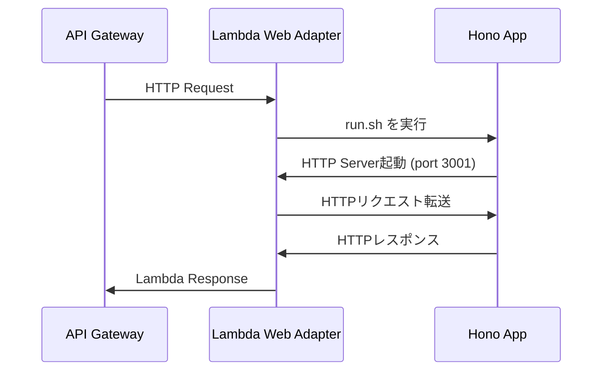

# Lambda Web Adapter セットアップガイド

## 概要

Lambda Web Adapter を使用して、標準的なHTTPサーバー（Hono）をAWS Lambdaで実行します。

**重要**: Dockerイメージではなく、**AWS管理ランタイム（Node.js 20.x）+ ZIPパッケージ** を使用します。

## アーキテクチャ

```
API Gateway → Lambda (Node.js 20.x)
              ├── Lambda Web Adapter Layer (/opt/bootstrap)
              └── Hono Application (index.js + run.sh)
```

## セットアップ手順

### 1. Lambda Web Adapter Layer

AWS公式の Lambda Layer を使用：

```typescript
// CDK
const lambdaAdapterLayerArn =
  `arn:aws:lambda:${region}:753240598075:layer:LambdaAdapterLayerX86:25`;

const lambdaAdapterLayer = lambda.LayerVersion.fromLayerVersionArn(
  this,
  'LambdaAdapterLayer',
  lambdaAdapterLayerArn
);
```

**注意**:
- x86_64アーキテクチャ用: `LambdaAdapterLayerX86`
- **ARM64用（推奨・コスト削減）**: `LambdaAdapterLayerArm64`

このプロジェクトでは **ARM64アーキテクチャ** を使用してコストを削減しています。

### 2. 環境変数設定

```typescript
environment: {
  // Lambda Web Adapter有効化（必須）
  AWS_LAMBDA_EXEC_WRAPPER: '/opt/bootstrap',

  // ストリーミングレスポンス有効化（推奨）
  AWS_LWA_INVOKE_MODE: 'response_stream',

  // アプリケーション設定
  PORT: '3001',
  NODE_ENV: 'production',
  // ... その他の環境変数
}
```

### 3. ハンドラー設定

```typescript
handler: 'run.sh',  // シェルスクリプトを指定
```

### 4. run.sh スクリプト

```bash
#!/bin/bash
exec node index.js
```

このスクリプトは：
- Lambda Web Adapter によって実行される
- Node.js サーバー（Hono）を起動
- HTTPリクエストを処理

### 5. ビルドプロセス

```bash
# 1. esbuild でバンドル
npm run build

# 2. 成果物
dist/api/
├── index.js        # バンドルされたアプリケーション
├── run.sh          # 起動スクリプト
└── package.json    # 依存関係定義
```

### 6. デプロイ

CDKが自動的に：
1. `dist/api` をZIPパッケージ化
2. Lambda Layer（Web Adapter）をアタッチ
3. 環境変数を設定
4. デプロイ

## 動作原理



### 処理フロー

1. **Lambda起動時**:
   - `AWS_LAMBDA_EXEC_WRAPPER=/opt/bootstrap` により Lambda Web Adapter が起動
   - Lambda Web Adapter が `run.sh` を実行
   - `run.sh` が `node index.js` でHonoサーバーを起動
   - サーバーが `PORT=3001` でリッスン開始

2. **リクエスト処理時**:
   - API Gateway → Lambda Web Adapter
   - Lambda Web Adapter → localhost:3001 (Honoアプリ)
   - Honoアプリが通常のHTTPリクエストとして処理
   - レスポンスを返す

3. **レスポンス返却時**:
   - Lambda Web Adapter がHTTPレスポンスをLambda形式に変換
   - API Gateway経由でクライアントへ返却

## メリット

### Dockerイメージ vs ZIPパッケージ

| 項目 | Dockerイメージ | ZIPパッケージ |
|------|---------------|--------------|
| **デプロイ速度** | 遅い（イメージビルド必要） | 速い |
| **コールドスタート** | 遅い | 速い |
| **サイズ制限** | 10GB | 250MB（解凍後） |
| **コスト** | ECRストレージ課金 | 無料 |
| **管理** | ECRレジストリ管理必要 | 不要 |
| **ローカル互換性** | 高い | 高い |

### Lambda Web Adapterのメリット

1. **コード変更不要**: 既存のHTTPサーバーをそのまま使用
2. **フレームワーク非依存**: Hono, Express, Fastify等すべて対応
3. **ローカル開発と同一**: 同じコードでローカル/Lambda実行可能
4. **ストリーミング対応**: レスポンスストリーミング可能

## トラブルシューティング

### サーバーが起動しない

```bash
# run.sh の実行権限を確認
chmod +x run.sh

# Lambda ログを確認
aws logs tail /aws/lambda/siftr-api --follow
```

### ポート番号エラー

```typescript
// 環境変数でポート指定（必須）
environment: {
  PORT: '3001',
}
```

### タイムアウト

```typescript
// タイムアウト設定を調整
timeout: cdk.Duration.seconds(30),  // デフォルト3秒は短すぎる
```

### メモリ不足

```typescript
// メモリを増やす
memorySize: 512,  // 最低512MB推奨
```

## 参考リンク

- [Lambda Web Adapter GitHub](https://github.com/awslabs/aws-lambda-web-adapter)
- [ZIP Package Example](https://github.com/awslabs/aws-lambda-web-adapter/tree/main/examples/expressjs-zip)
- [Layer ARNs](https://github.com/awslabs/aws-lambda-web-adapter#aws-managed-lambda-layer-and-layers-hosted-in-public-ecr)

## ローカル開発

ローカルでは Lambda Web Adapter は不要：

```bash
# 通常のNode.jsサーバーとして起動
npm run dev

# Honoが直接 localhost:3001 でリッスン
```

Lambda Web Adapter は本番環境（Lambda）でのみ必要です。
